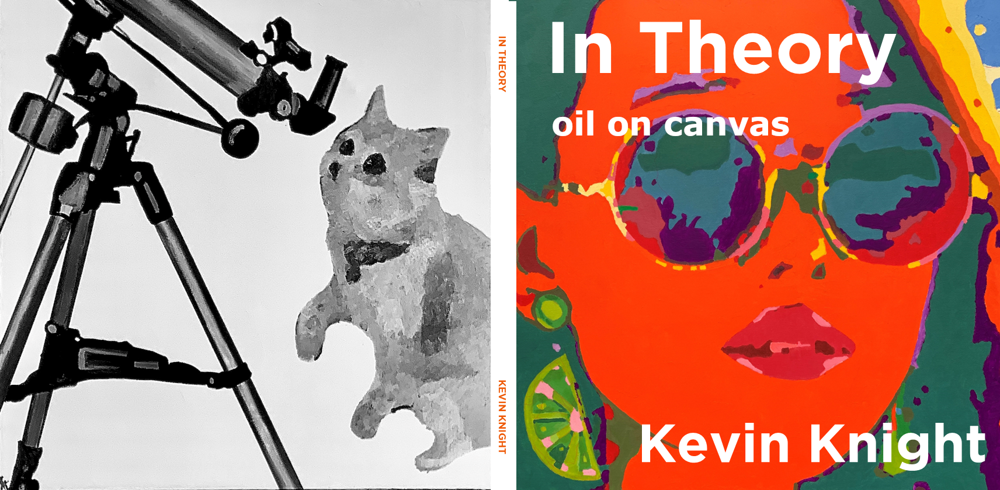

# In Theory

### book: <a href="https://www.amazon.com">get it here</a>
### contact:  <a href="mailto:in.theory.originals@gmail.com">in.theory.originals@gmail.com</a>

 

### also by the author: <a href="https://www.amazon.com">Math Kook</a> (2022), <a href="https://www.amazon.com/Artificial-Intelligence-Elaine-Rich/dp/0070522634/ref=sr_1_2?crid=14AZ5I9B1ISN1&keywords=kevin+knight+artificial+intelligence&qid=1659386396&sprefix=kevin+knight+artificial+intelligenc%2Caps%2C161&sr=8-2)">Artificial Intelligence</a> (1990)

### about the artist:
  
### The artist has served as a professor of computer science, chief scientist at three artificial intelligence companies, and president of his international scientific society. He is currently splitting his time between indoors and outdoors.
